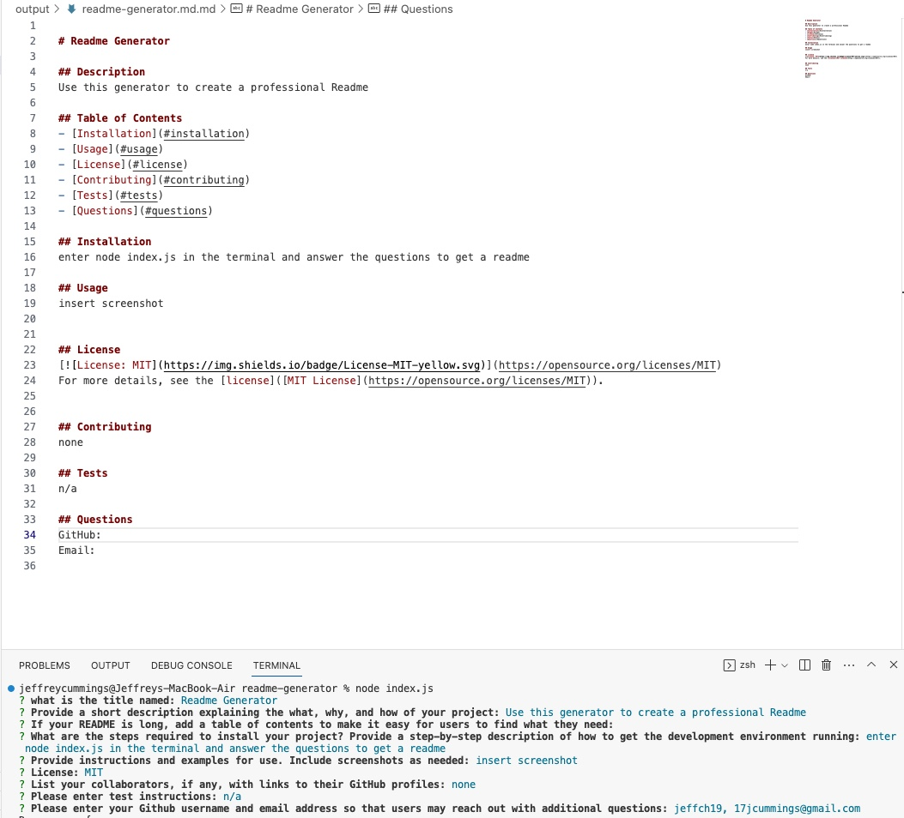

# Readme Generator

## Description
Use this generator to create a professional README with Node!

## Installation
enter node index.js in the terminal and answer the questions to generate a README

## Usage

## License
Please refer to the license in the repo.

